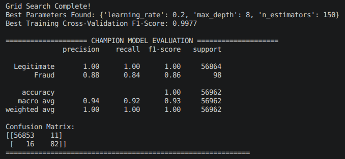

# Credit Card Fraud Detector

The aim of this project is to use the Kaggle Credit Card Fraud dataset to build a model capable of identifying fraudulent transactions, while keeping false alarms on genuine transactions to a minimum.

## The Problem

The biggest challenge with fraud detection is that fraudulent transactions are extremely rare — this makes it hard for a model to learn what "fraud" looks like. It's also critical that the detector doesn't over-flag genuine transactions, since that erodes customer trust and creates unnecessary friction.

Because fraud is so rare, **accuracy is not a meaningful metric here** — a model that predicts "legitimate" for every single transaction would score 99.83% accuracy while catching zero fraud. This project instead tracks recall (fraud caught), precision (false alarm rate), F1/F2-score, and precision-recall AUC.

## Dataset

- Source: [Kaggle Credit Card Fraud Detection dataset](https://www.kaggle.com/mlg-ulb/creditcardfraud)
- 284,807 transactions, 31 columns (`Time`, `V1`–`V28`, `Amount`, `Class`)
- No missing values; all features numerical
- `V1`–`V28` have been anonymised via PCA transformation to protect sensitive data — they're no longer human-interpretable but remain statistically useful and are correctly centred at zero, confirming a valid transformation
- `Amount` ranges from £0 to £25,691, median £22 — heavily right-skewed with outliers
- Data spans 48 hours
- Severe class imbalance: 492 fraud cases vs. 284,315 legitimate (≈1:578)

## Why EDA?

Before training any model, we need to understand the data. EDA verifies data quality, visualises the class imbalance, surfaces patterns that separate fraud from legitimate transactions, and identifies the most informative features. Skipping this risks building a model on flawed assumptions and getting poor real-world performance.

## Project Structure

| File | Purpose |
|---|---|
| `main.py` | Runs the full pipeline end to end, steps 1 → 9 |
| `step1_load.py` | Loads the raw CSV, reports shape and missing values |
| `step2_eda.py` / `Data_Visulization.py` | Generates the EDA dashboard: class distribution, correlation matrix, amount distribution, fraud-vs-time scatter (optional — not called by `main.py` by default) |
| `step3_preprocessing.py` | Feature engineering (log-amount, cyclic hour-of-day) and a train/validation/test split, with the scaler fit on the training split only |
| `step4_balance.py` | Legacy standalone SMOTE demo — superseded by steps 6–7, which apply SMOTE inside the CV pipeline instead |
| `step5_train.py` | Legacy baseline XGBoost training — superseded by steps 6–7 |
| `step6_tune.py` | Grid search over XGBoost hyperparameters, with SMOTE inside the pipeline (no leakage), scored on F2 |
| `step7_tune_SMOTE.py` | Grid search over SMOTE's sampling ratio and `scale_pos_weight`, locking in step 6's champion XGBoost params |
| `step8_threshold.py` | Picks the decision threshold on the validation set by maximising F2, instead of using the default 0.5 cutoff |
| `step9_evaluate.py` | The final, one-time evaluation on the untouched test set |
| `step10_threshold_sweep.py` | Optional diagnostic: prints precision/recall/F1/F2 across a full range of thresholds, so you can eyeball the tradeoff instead of trusting the F2-optimizer's single pick |

`step4_balance.py` and `step5_train.py` are kept for reference but aren't called by `main.py` — they represent the original, simpler approach before the leakage fixes below.

## Pipeline

```
load data → preprocess (feature engineer + scale + train/val/test split)
          → tune XGBoost hyperparameters (SMOTE in-pipeline, F2-scored)
          → tune SMOTE ratio + scale_pos_weight
          → tune decision threshold on validation set
          → final evaluation on untouched test set
          → save model, scaler, threshold
```

## Results

| Run | Setup | False Alarms | Missed Fraud | Fraud Caught | Precision | Recall | F1 |
|---|---|---|---|---|---|---|---|
| 1 | Baseline, 50/50 SMOTE | 153 | 12 | 86 | — | — | — |
| 2 | `max_depth` 6 → 8 | see `Second_run.png` / `third.png` | | | | | |
| 3 | GridSearchCV-tuned (pre-fix, leaked CV) | 11 | 16 | 82 | 0.88 | 0.84 | 0.86 |
| 4 | **Current pipeline** (leakage fixed, F2-scored, tuned threshold) | **6** | **17** | **81** | **0.93** | **0.83** | **0.88** |

Run 3's cross-validation F1 score reported **0.9977** during grid search, but real test-set F1 was only **0.86** — a 14-point gap that's a textbook symptom of the leakage bug fixed in the current pipeline (SMOTE was being applied *before* the CV split, so folds contained synthetic samples derived from each other, inflating the CV score). The current pipeline applies SMOTE inside the CV pipeline itself, so its CV score should track its real test performance far more closely.

Run 4 also reports a **Precision-Recall AUC of 0.8667** on the test set, which is a more reliable measure of overall model quality than any single threshold's precision/recall numbers.




## How to Run

```bash
python main.py
```

Run it from the project root or from `steps/` — the path handling adjusts automatically. It expects `data/creditcard.csv` to exist at the project root, and will save `fraud_model.joblib`, `amount_scaler.joblib`, and `decision_threshold.joblib` there when finished.

To explore the threshold tradeoff in more detail after a training run:

```bash
python steps/step10_threshold_sweep.py
```

## Key Fixes Applied

The current pipeline (steps 3, 6, 7 + new steps 8, 9) fixes three issues present in the original version:

1. **Scaler leakage** — the original `StandardScaler` was fit on the full dataset before the train/test split, leaking test-set statistics into training. It's now fit on the training split only.
2. **SMOTE leakage during tuning** — the original grid search tuned hyperparameters on data that had already been SMOTE-balanced *before* cross-validation, so folds shared synthetic samples derived from each other. SMOTE now lives inside the CV pipeline and is refit fresh on every fold.
3. **Recall-only / F1-only scoring** — plain recall is trivially maximised by flagging everything as fraud; grid search now optimises F2, which still penalises false alarms while weighting recall more heavily than precision.

## Possible Next Steps for Further Accuracy

- Try `SMOTETomek`, `BorderlineSMOTE`, or `ADASYN` for noisier fraud boundaries
- Try LightGBM or CatBoost as alternatives to XGBoost
- Revisit external/holdout testing (e.g. a later time-slice of the same data) once the current pipeline's results are locked in
- Explore stacking an anomaly-detection model (e.g. Isolation Forest) as an additional feature

## Notes

- Built using the Jupyter plugin in VS Code for interactive graphs