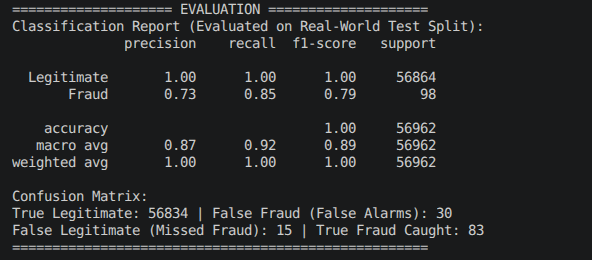
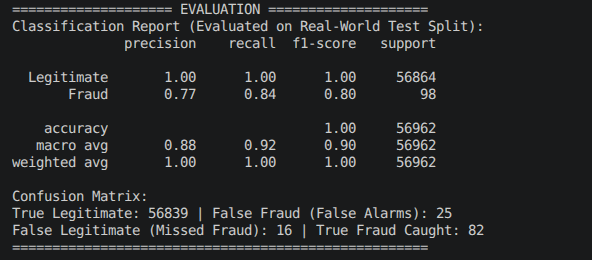

# Credit-Card-Fruad-Detecor
The aim of this project is to use the kaggle credit card fraud dataset and to make a suitable programme that is able to identify all fraudulent transactions. 

The kaggle dataset has been transformed to anonymize the data as it is sensitive. The columns affected by this transformation are V1-V28. Even though these columns have been transformed and are no linger interpret able they can still be useful statistically. 

The biggest challenge with fraud detection is that an extremely small amount of transactions are actually fraudulent. This makes it very difficult to detect the individual fraudulent transactions. It is also very important that fraud detectors do not flag genuine transactions as this can become very irritating for customers. 

We loaded the Kaggle Credit Card Fraud dataset containing 284,807 transactions and 31 columns (Time, V1–V28, Amount, Class). No missing values were found. All features are numerical. The dataset is heavily imbalanced — only 0.17% of transactions are fraudulent. This imbalance must be addressed before training.

Dataset is 67.4MB, fully loaded in memory. All 284,807 rows have complete data. V1–V28 features are correctly centred at zero (confirming valid PCA transformation). Amount ranges from £0 to £25,691 with a median of just £22 — heavy right skew with outliers. Data spans 48 hours. Class imbalance is severe: 492 fraud cases vs 284,315 legitimate (ratio of 1:578).

Why EDA? Before training any model, we need to understand the data we're working with. EDA helps us verify data quality, visualise the class imbalance, identify patterns that separate fraud from legitimate transactions, and determine which features are most informative. Skipping EDA risks building a model on flawed assumptions, leading to poor real-world performance.

Training 

First run used 50/50 SMOTE and came back with 153 false alarms and 12 missed frauds. With 86 legitimate frauds caught. 

second run

Increase max depth from 6 to 8. 

NOTES:

Using Jupyter plugin in vscode for graphs. 
